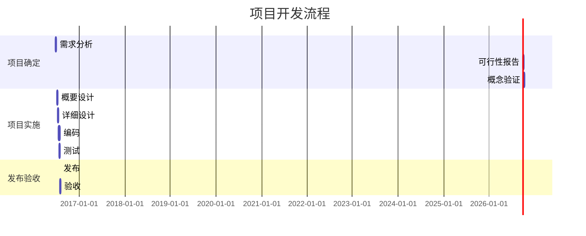
```mermaid
gantt
    title 项目开发流程
    section 项目确定
        需求分析       :2016-06-22, 5d
        可行性报告     :after a1, 5d
        概念验证       : 5d
    section 项目实施
        概要设计      :2016-07-05  , 5d
        详细设计      :2016-07-08, 10d
        编码          :2016-07-15, 10d
        测试          :2016-07-22, 5d
    section 发布验收
        发布: 2d
        验收: 3d
```

|     |     |
| --- | --- |
| 撒旦撒 | 撒打算 |
| 大萨达 | 阿达  |
| 大声道 | 萨达  |

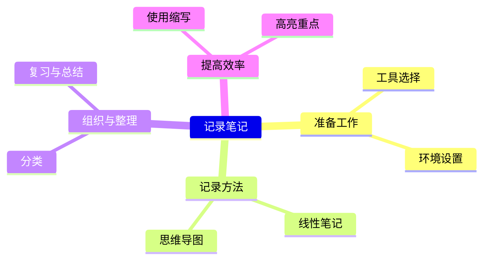
```mermaid
mindmap
  记录笔记
    准备工作
      工具选择
      环境设置
    记录方法
      线性笔记
      思维导图
    组织与整理
      分类
      复习与总结
    提高效率
      使用缩写
      高亮重点
```  

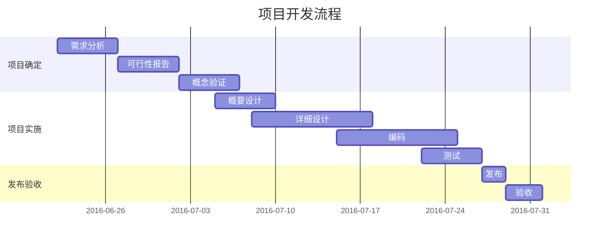
```mermaid
gantt
    title 项目开发流程
    dateFormat YYYY-MM-DD
    section 项目确定
        需求分析       :a1, 2016-06-22, 5d
        可行性报告     :a2, after a1, 5d
        概念验证       :a3, after a2, 5d
    section 项目实施
        概要设计      :b1, 2016-07-05, 5d
        详细设计      :b2, 2016-07-08, 10d
        编码          :b3, 2016-07-15, 10d
        测试          :b4, 2016-07-22, 5d
    section 发布验收
        发布          :c1, after b4, 2d
        验收          :c2, after c1, 3d
```

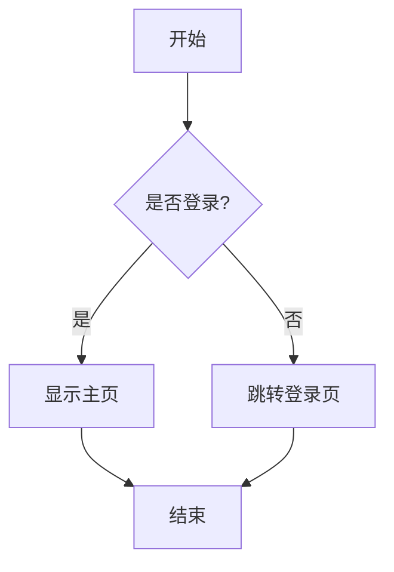
```mermaid
graph TD
    A[开始] --> B{是否登录?}
    B -->|是| C[显示主页]
    B -->|否| D[跳转登录页]
    C --> E[结束]
    D --> E
```

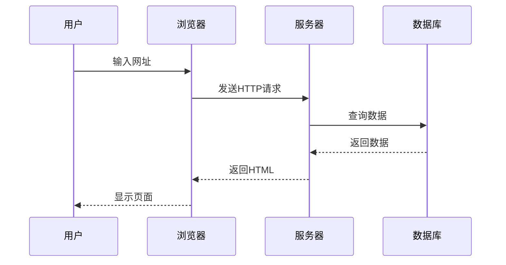
```mermaid
sequenceDiagram
    participant 用户
    participant 浏览器
    participant 服务器
    participant 数据库
    
    用户->>浏览器: 输入网址
    浏览器->>服务器: 发送HTTP请求
    服务器->>数据库: 查询数据
    数据库-->>服务器: 返回数据
    服务器-->>浏览器: 返回HTML
    浏览器-->>用户: 显示页面
```

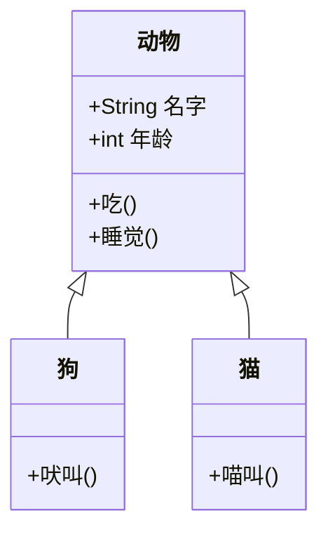
```mermaid
classDiagram
    class 动物 {
        +String 名字
        +int 年龄
        +吃()
        +睡觉()
    }
    class 狗 {
        +吠叫()
    }
    class 猫 {
        +喵叫()
    }
    动物 <|-- 狗
    动物 <|-- 猫
```

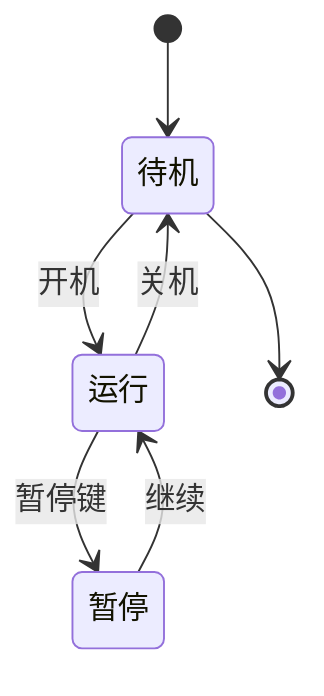
```mermaid
stateDiagram-v2
    [*] --> 待机
    待机 --> 运行: 开机
    运行 --> 暂停: 暂停键
    暂停 --> 运行: 继续
    运行 --> 待机: 关机
    待机 --> [*]
```

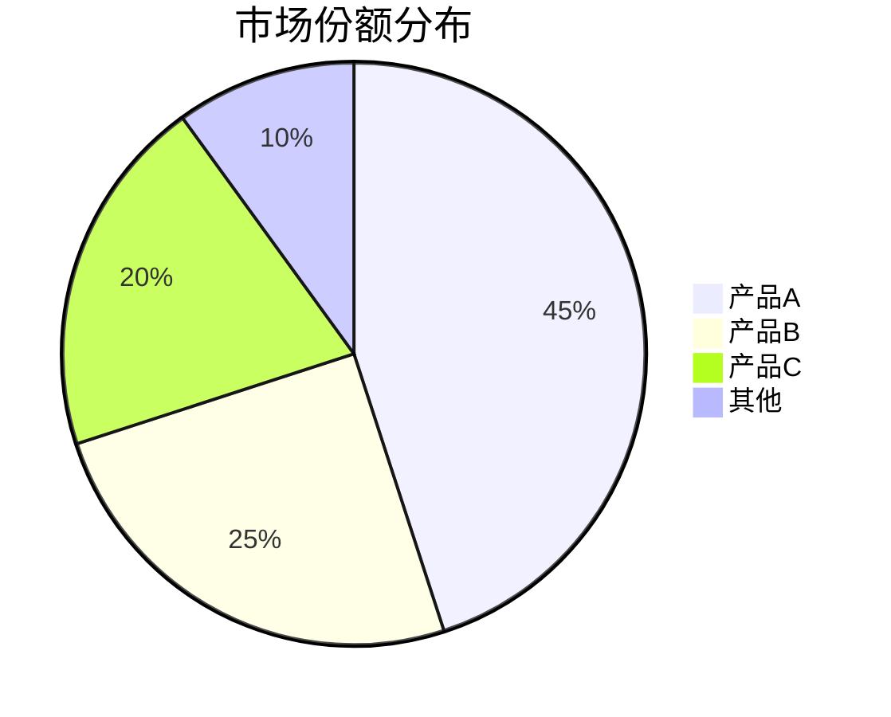
```mermaid
pie title 市场份额分布
    "产品A" : 45
    "产品B" : 25
    "产品C" : 20
    "其他" : 10
```

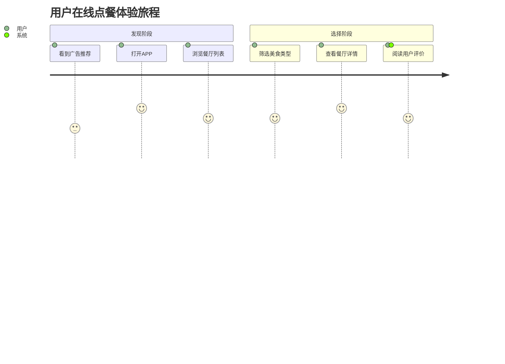
```mermaid
journey
    title 用户在线点餐体验旅程
    section 发现阶段
      看到广告推荐: 3: 用户
      打开APP: 5: 用户
      浏览餐厅列表: 4: 用户
    section 选择阶段
      筛选美食类型: 4: 用户
      查看餐厅详情: 5: 用户
      阅读用户评价: 4: 用户, 系统
```

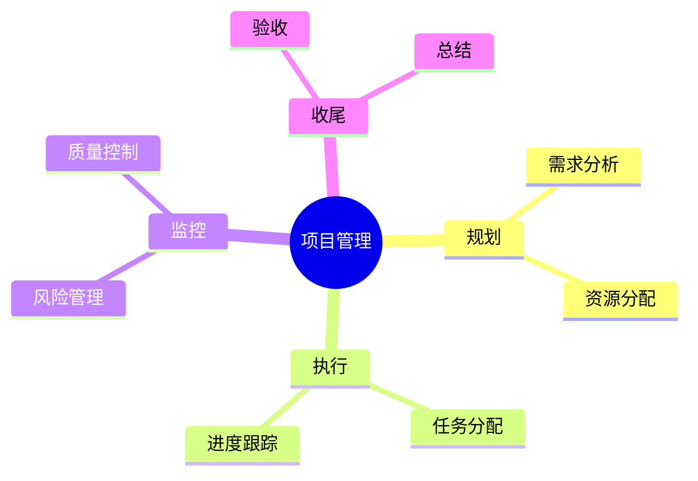
```mermaid
mindmap
  root((项目管理))
    规划
      需求分析
      资源分配
    执行
      任务分配
      进度跟踪
    监控
      风险管理
      质量控制
    收尾
      验收
      总结
```

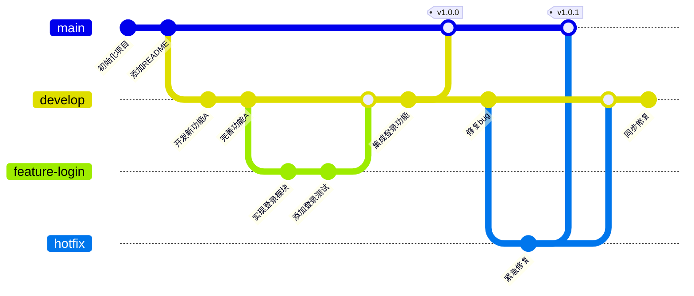
```mermaid
gitGraph
    commit id: "初始化项目"
    commit id: "添加README"
    
    branch develop
    checkout develop
    commit id: "开发新功能A"
    commit id: "完善功能A"
    
    branch feature-login
    checkout feature-login
    commit id: "实现登录模块"
    commit id: "添加登录测试"
    
    checkout develop
    merge feature-login
    commit id: "集成登录功能"
    
    checkout main
    merge develop tag: "v1.0.0"
    
    checkout develop
    commit id: "修复bug"
    
    branch hotfix
    checkout hotfix
    commit id: "紧急修复"
    
    checkout main
    merge hotfix tag: "v1.0.1"
    
    checkout develop
    merge hotfix
    commit id: "同步修复"
```

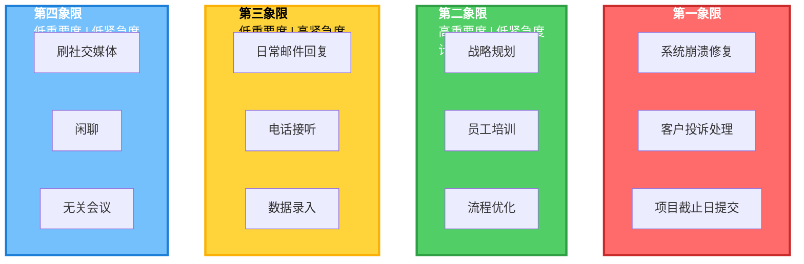
```mermaid
graph TB
    subgraph q1[<b>第一象限</b>]
        A1["系统崩溃修复"]
        A2["客户投诉处理"]
        A3["项目截止日提交"]
    end
    
    subgraph q2["<b>第二象限</b><br/>高重要度 | 低紧急度<br/>计划执行"]
        B1["战略规划"]
        B2["员工培训"]
        B3["流程优化"]
    end
    
    subgraph q3["<b>第三象限</b><br/>低重要度 | 高紧急度<br/>授权委托"]
        C1["日常邮件回复"]
        C2["电话接听"]
        C3["数据录入"]
    end
    
    subgraph q4["<b>第四象限</b><br/>低重要度 | 低紧急度<br/>减少时间"]
        D1["刷社交媒体"]
        D2["闲聊"]
        D3["无关会议"]
    end
    
    style q1 fill:#ff6b6b,stroke:#c92a2a,stroke-width:3px,color:#fff
    style q2 fill:#51cf66,stroke:#2f9e44,stroke-width:3px,color:#fff
    style q3 fill:#ffd43b,stroke:#fab005,stroke-width:3px,color:#000
    style q4 fill:#74c0fc,stroke:#1c7ed6,stroke-width:3px,color:#fff
```

```mermaid
graph TB
    subgraph q1["第一象限：高重要度 高紧急度 - 立即执行"]
        direction TB
        A1["系统崩溃修复"]
        A2["客户投诉处理"]
        A3["项目截止日提交"]
    end
    
    subgraph q2["第二象限：高重要度 低紧急度 - 计划执行"]
        direction TB
        B1["战略规划"]
        B2["员工培训"]
        B3["流程优化"]
    end
    
    subgraph q3["第三象限：低重要度 高紧急度 - 授权委托"]
        direction TB
        C1["日常邮件回复"]
        C2["电话接听"]
        C3["数据录入"]
    end
    
    subgraph q4["第四象限：低重要度 低紧急度 - 减少时间"]
        direction TB
        D1["刷社交媒体"]
        D2["闲聊"]
        D3["无关会议"]
    end
    
    style q1 fill:#ff6b6b,stroke:#c92a2a,stroke-width:3px,color:#fff
    style q2 fill:#51cf66,stroke:#2f9e44,stroke-width:3px,color:#fff
    style q3 fill:#ffd43b,stroke:#fab005,stroke-width:3px,color:#000
    style q4 fill:#74c0fc,stroke:#1c7ed6,stroke-width:3px,color:#fff
```