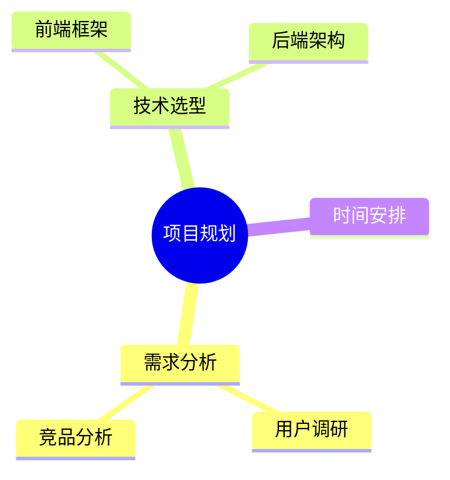

---
title:
description:
permalink:
aliases:
draft:
date: 2025-12-28
tags:
  - 3D
---
%% <iframe src="https://pano.dpm.org.cn/#/" width="100%" height="600px"></iframe>%%

 <iframe src="https://coderlaoluo.feishu.cn/docx/PFXSdZAwnoUaApxg4cOcJ9Dln6e?openbrd=1&doc_app_id=501&blockId=doxcncXY5E8ThDd9zAyKNN1aJrc&blockType=whiteboard&blockToken=KXLUwZOWUhKsS5b8z4XczWbqnkq#doxcncXY5E8ThDd9zAyKNN1aJrc" width="100%" height="600px"></iframe>

 <iframe src="https://scnc5lj07xf7.feishu.cn/wiki/JofCwjUeZiRLKikEvwqcfbMqnfl" width="100%" height="600px"></iframe>