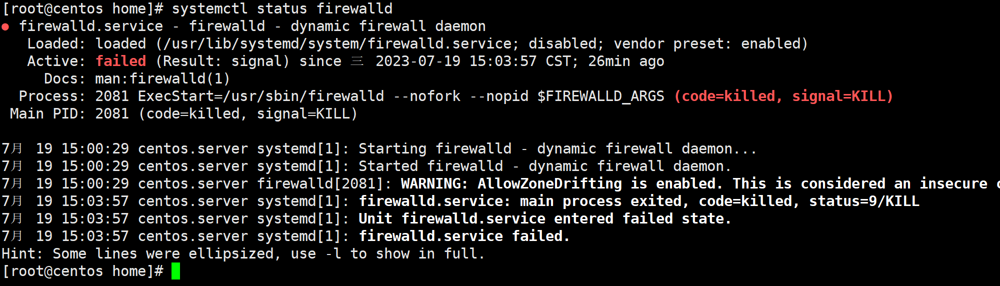

### 服务

#### 服务启动关闭

```shell
#以mysql服务为例

#启动mysql服务
systemctl start mysql

#关闭mysql服务
systemctl stop mysql

#设置mysql开机自启
systemctl enable mysql

#取消开机自启
systemctl disable mysql
```

##### 查看正在运行的服务

```shell
#查看所有进程
ps -A
[root@centos system]# ps -A
   PID TTY          TIME CMD
     1 ?        00:00:02 systemd
     2 ?        00:00:00 kthreadd
     4 ?        00:00:00 kworker/0:0H
     5 ?        00:00:03 kworker/u256:0
     6 ?        00:00:00 ksoftirqd/0
     7 ?        00:00:00 migration/0
     8 ?        00:00:00 rcu_bh
     9 ?        00:00:06 rcu_sched
    10 ?        00:00:00 lru-add-drain
    11 ?        00:00:00 watchdog/0
    12 ?        00:00:00 watchdog/1
    13 ?        00:00:00 migration/1
```

```shell
#查找指定进程 ps -ef | grep 进程关键字
[root@centos system]# ps -ef | grep log
root        433      2  0 08:58 ?        00:00:00 [xfs-log/dm-0]
root        655      2  0 08:58 ?        00:00:00 [xfs-log/sda1]
root        707      1  0 08:58 ?        00:00:00 /usr/lib/systemd/systemd-logind
root        981      1  0 08:58 ?        00:00:11 /usr/sbin/rsyslogd -n
root       2017   1955  0 14:48 pts/1    00:00:00 grep --color=auto log

```

```shell
#显示指定用户信息
ps -u root
```

##### 结束进程

```shell
#终止进程
kill 进程号
#立刻终止进程
kill -9 进程号

#示例：杀死firewalld
[root@centos home]# ps -A
   PID TTY          TIME CMD
     1 ?        00:00:02 systemd
     2 ?        00:00:00 kthreadd
     4 ?        00:00:00 kworker/0:0H
     5 ?        00:00:03 kworker/u256:0
     6 ?        00:00:00 ksoftirqd/0
  2081 ?        00:00:00 firewalld
  2173 pts/1    00:00:00 ps

#杀死firewalld
kill -9 2081
```

##### 查看端口占用情况

```shell
[root@server102 bin]# netstat -nltp
Active Internet connections (only servers)
Proto Recv-Q Send-Q Local Address           Foreign Address         State       PID/Program name    
tcp        0      0 0.0.0.0:111             0.0.0.0:*               LISTEN      729/rpcbind         
tcp        0      0 0.0.0.0:22              0.0.0.0:*               LISTEN      1019/sshd           
tcp        0      0 127.0.0.1:25            0.0.0.0:*               LISTEN      1241/master         
tcp6       0      0 :::111                  :::*                    LISTEN      729/rpcbind         
tcp6       0      0 :::22                   :::*                    LISTEN      1019/sshd           
tcp6       0      0 ::1:25                  :::*                    LISTEN      1241/master         
tcp6       0      0 :::33060                :::*                    LISTEN      2315/mysqld         
tcp6       0      0 :::3306                 :::*                    LISTEN      2315/mysqld   
```
### 网络配置

>Linux 网络配置文件位置 /etc/sysconfig/network-scripts/ifcfg-ens33

#### 设置虚拟机固定IP

```shell
 # 编辑文件
   vim /etc/sysconfig/network-scripts/ifcfg-ens33
   # 在文件中修改如下内容
   TYPE="Ethernet"
   PROXY_METHOD="none"
   BROWSER_ONLY="no"
   # 修改为static
   BOOTPROTO="static"
   DEFROUTE="yes"
   IPV4_FAILURE_FATAL="no"
   IPV6INIT="yes"
   IPV6_AUTOCONF="yes"
   IPV6_DEFROUTE="yes"
   IPV6_FAILURE_FATAL="no"
   IPV6_ADDR_GEN_MODE="stable-privacy"
   NAME="ens33"
   UUID="e3d579bd-d369-4afd-bc96-b3431e9ab156"
   DEVICE="ens33"
   # 修改为yes
   ONBOOT="yes"
   #添加如下内容
   IPADDR="192.168.42.101"
   NETMASK="255.255.255.0"
   GATEWAY="192.168.42.2"
   DNS1="8.8.8.8"
   # DNS1="114.114.114.114"
   
   #修改完完后重启网络
   systemctl restart network
```

> IPADDR：为本机IP
> GATEWAY：网关IP,在VMware的编辑-->虚拟网络编辑器-->NAT设置可以看到，一般2结尾

#### 修改主机名

```shell
vim /etc/hostname
```

####  修改ip映射

```shell
 #修改ip映射
vim /etc/hosts
   
192.168.42.101   www.xx01.com
192.168.42.102   www.xx02.com
192.168.42.103   www.xx02.com
```

### 防火墙

#### 防火墙状态管理

```shell
#查看防火墙状态
systemctl status firewalld

#或者
[root@centos home]# firewall-cmd --state
not running
```



>failed说明没有启动

启动防火墙

```shell
systemctl start firewalld
```

关闭防火墙

```shell
systemctl  stop  firewalld
```

开机启动

```shell
systemctl enable firewalld
```

开机禁用

```shell
systemctl disable firewalld
```

重启防火墙

```shell
systemctl restart firewalld
```

查看是否开机自启

```shell
systemctl is-enabled firewalld
```

#### 开放防火墙端口


```shell
#查看已经开放的防火墙端口
firewall-cmd --list-ports
#查看具体端口是否开放，例如80端口
[root@centos home]# firewall-cmd --query-port=80/tcp
no

#开放80端口
firewall-cmd --zone=public --add-port=80/tcp --permanent

#重新载入防火墙
firewall-cmd --reload

#移除开放的端口
firewall-cmd --zone=public --remove-port=80/tcp --permanent

```
