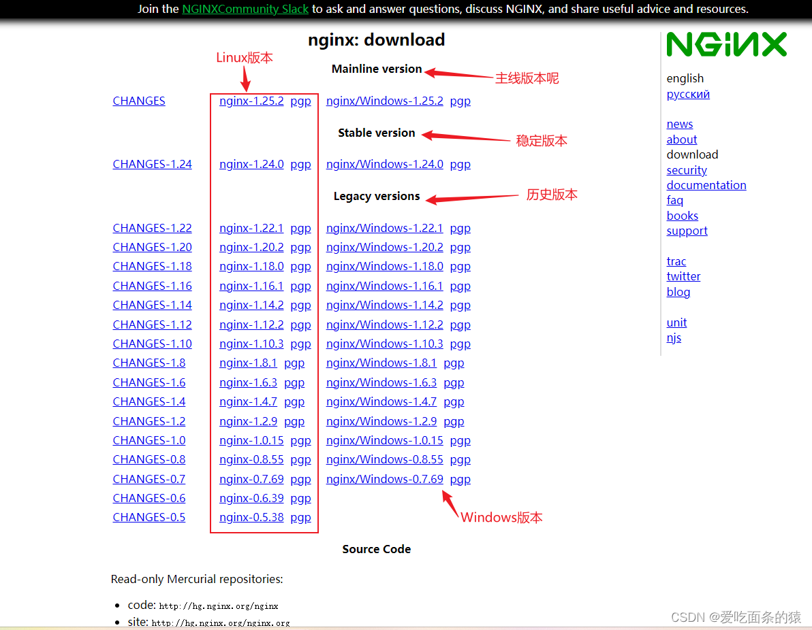

### 下载nginx

>地址：https://nginx.org/en/download.html


### 安装nginx需要的包

> yum install -y gcc-c++ zlib zlib-devel openssl openssl-devel pcre pcre-devel
### 解压nginx

> tar -zxvf nginx-1.24.0.tar.gz
### 安装配置

进入安装目录 nginx-1.24.0 执行如下命令

```shell
./configure \
--prefix=/usr/local/nginx \
--pid-path=/var/run/nginx.pid \
--lock-path=/var/lock/nginx.lock \
--error-log-path=/var/log/nginx/error.log \
--http-log-path=/var/log/nginx/access.log \
--with-http_gzip_static_module \
--http-client-body-temp-path=/var/temp/nginx/client \
--http-proxy-temp-path=/var/temp/nginx/proxy \
--http-fastcgi-temp-path=/var/temp/nginx/fastgi \
--http-uwsgi-temp-path=/var/temp/nginx/uwsgi \
--http-scgi-temp-path=/var/temp/nginx/scgi \
--with-http_stub_status_module \
--with-http_ssl_module \
--with-http_stub_status_module 
```
### 编译和安装

上一步配置执行完后，在nginx-1.24.0目录下执行如下命令进行编译和安装

>make & make install
### 启动nginx

进入/usr/local/nginx/sbin目录

检查配置是否正确

> ./nginx -t

如果出现
>nginx: [emerg] mkdir() "/var/temp/nginx/client" failed (2: No such file or directory)

创建对应的目录即可

>mkdir -p /var/temp/nginx

```shell
# 执行启动
./nginx
#./nginx -c /usr/local/nginx/conf/nginx.conf
# 停止：
./nginx -s stop
# 重新加载：
./nginx -s reload 
```

浏览器输入ip地址，出现如下页面


### nginx配置

#### 反向代理

```conf
server {
	listen       18088;                 /*nginx端口*/
	server_name  localhost;

	#charset koi8-r;

	#access_log  logs/host.access.log  main;

	location / {
		proxy_pass http://172.31.0.5:8080;
	}
```

#### 同端口多路径

http://172.31.0.5:18088/tomcat85 进入http://172.31.0.5:8080
http://172.31.0.5:18088/tomcat80 进入http://172.31.0.5:18083
```conf
server {
        listen       18088;        /*nginx端口*/
        server_name  172.31.0.5;   /*访问ip地址*/

        location ~ /tomcat85/ {
            proxy_pass http://172.31.0.5:8080;     /*tomcat8.5版本*/
        }
        location ~ /tomcat80/ {
            proxy_pass http://172.31.0.5:18083;    /*tomcat8.5版本*/
        }
}
```
#### 负载均衡
##### 均衡公平调度

```conf
upstream firstserver {
        server 172.31.0.5:8080;
        server 172.31.0.8:18083;
}

server {
	listen       18088;
	server_name  172.31.0.5;

	location / {
		proxy_pass http://firstserver;
	}
}
```

##### 权重分配

```conf
upstream myserver {
    server 172.31.0.5:8080 weight=5;
    server 172.31.0.8:18083 weight=10; 
}
server {
	listen       18088;
	server_name  172.31.0.5;

	location / {
		proxy_pass http://myserver;
	}
}
```

##### ip_hash

>每个请求按照ip的hash结果分配，只要用户第一次访问哪个ip，之后每次访问都是那个ip，解决session的问题。

```conf
upstream myserver {
    ip_hash;
    server 172.31.0.5:8080;
    server 172.31.0.8:18083;
}
server {
	listen       18088;
	server_name  172.31.0.5;

	location / {
		proxy_pass http://myserver;
	}
}
```
##### 热备

```conf
upstream firstserver {
    server 172.31.0.5:8080 backup;
    server 172.31.0.8:18083;
}
server {
	listen       18088;
	server_name  172.31.0.5;

	location / {
		proxy_pass http://firstserver;
	}
}
```

#### 前端和静态资源配置

```conf
server {
	listen       80;   
	server_name  172.31.0.5;   

	location /www/ {     
		root   /data/;   
		index  index.html index.htm;
	}
	location /image/ {    
		root  /data/;     
		autoindex on;     
	}

	error_page   500 502 503 504  /50x.html;
	location = /50x.html {
		root   html;
	}
}
```


