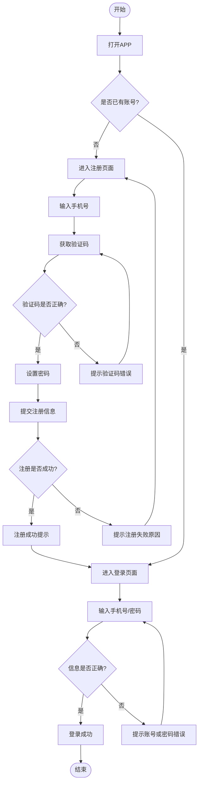

---
title:
description:
permalink:
aliases:
draft:
date: 2026-01-25
tags:
  - Java
  - Java基础
  - 黑马程序员
---
<iframe 
  src="https://share.mubu.com/doc/3ZHq6rUF4D0
" 
  width="100%" 
  style="height: 50vh; border: none;">
</iframe>

[欢迎使用 Xmind 在线导图 - Xmind 在线思维导图](https://app.xmind.cn/yMMelQCF?_gl=1*1vc15oe*_ga*MTg0ODA1OTE5OS4xNzY5MTY1NDM5*_ga_1T6MSGLZTB*czE3Njk4ODc3ODMkbzUkZzEkdDE3Njk4ODc4NDMkajYwJGwwJGgw)

<iframe 
  src="https://gitmind.cn/app/docs/fhmr8zss" 
  width="100%" 
  style="height: 50vh; border: none;">
</iframe>

【Xmind思维导图】欢迎使用 Xmind 在线导图 https://app.xmind.cn/share/yMMelQCF?xid=kSz9tK02

