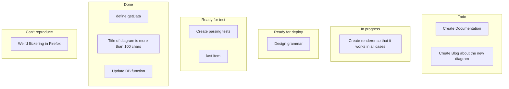
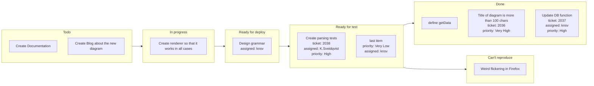
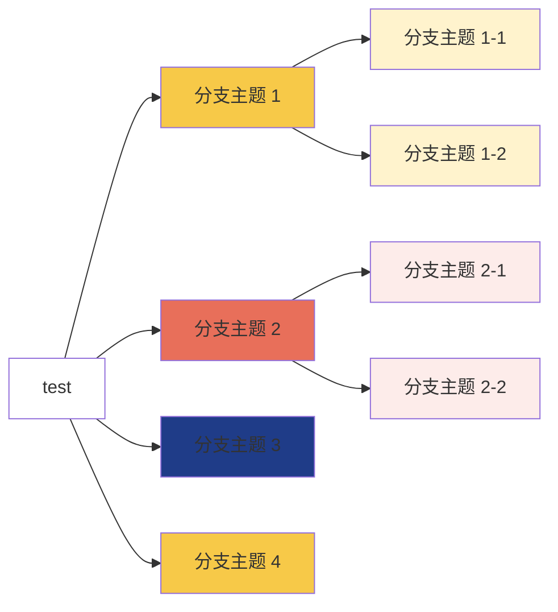

```mermaid
flowchart TB
    subgraph Todo
        A[Create Documentation]
        B[Create Blog about the new diagram]
    end
    
    subgraph "In progress"
        C[Create renderer so that it works in all cases]
    end
    
    subgraph "Ready for deploy"
        D[Design grammar]
    end
    
    subgraph "Ready for test"
        E[Create parsing tests]
        F[last item]
    end
    
    subgraph Done
        G[define getData]
        H[Title of diagram is more than 100 chars]
        I[Update DB function]
    end
    
    subgraph "Can't reproduce"
        J[Weird flickering in Firefox]
    end
```

```mermaid
flowchart LR
    subgraph Todo
        A[Create Documentation]
        B[Create Blog about the new diagram]
    end
    
    subgraph InProgress["In progress"]
        C[Create renderer so that it works in all cases]
    end
    
    subgraph ReadyDeploy["Ready for deploy"]
        D[Design grammar<br/>assigned: knsv]
    end
    
    subgraph ReadyTest["Ready for test"]
        E[Create parsing tests<br/>ticket: 2038<br/>assigned: K.Sveidqvist<br/>priority: High]
        F[last item<br/>priority: Very Low<br/>assigned: knsv]
    end
    
    subgraph Done
        G[define getData]
        H[Title of diagram is more than 100 chars<br/>ticket: 2036<br/>priority: Very High]
        I[Update DB function<br/>ticket: 2037<br/>assigned: knsv<br/>priority: High]
    end
    
    subgraph CantReproduce["Can't reproduce"]
        J[Weird flickering in Firefox]
    end
    
    Todo --> InProgress --> ReadyDeploy --> ReadyTest --> Done
    ReadyTest --> CantReproduce
```

```mermaid
flowchart LR
  A[test]

  A --> B[分支主题 1]
    B --> B01[分支主题 1-1]
    B --> B02[分支主题 1-2]

  A --> C[分支主题 2]
    C --> C01[分支主题 2-1]
    C --> C02[分支主题 2-2]

  A --> D[分支主题 3]
  A --> E[分支主题 4]

  %% 样式定义
  style A fill:#ffffff

  style B fill:#f7c948
  style C fill:#e86f5a
  style D fill:#1f3c88
  style E fill:#f7c948

  style B01 fill:#fff3cd
  style B02 fill:#fff3cd

  style C01 fill:#fdecea
  style C02 fill:#fdecea
```